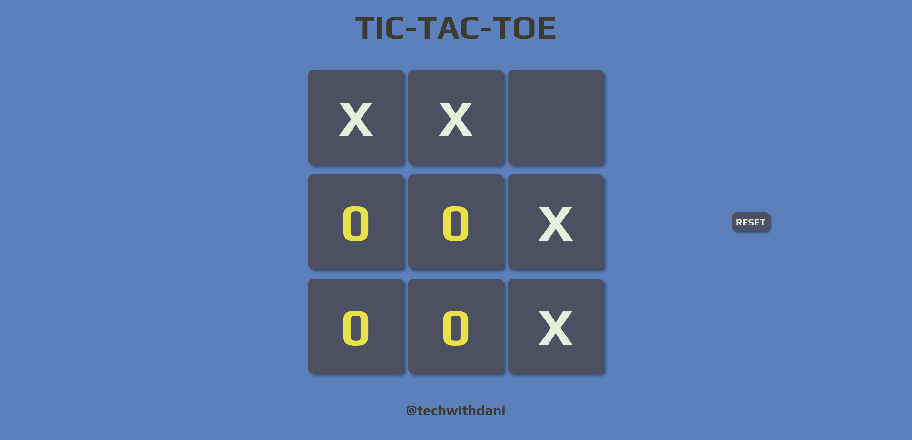

# Tic-Tac-Toe Game

This is a basic Tic-Tac-Toe game built with HTML, CSS, and JavaScript. Two players can take turns marking spaces on a 3x3 grid. The first player to get three of their marks in a row, column, or diagonal wins. If the board is full and no player wins, the game ends in a draw.

## How to Play:

1. Open the game in your web browser.
2. Two players take turns clicking empty spaces on the game board.
3. The first player to get three of their marks in a row, column, or diagonal wins.
4. If all spaces are filled and no player wins, the game is a draw.
5. Click the "Reset" button to start a new game at any time.

## Features:

1. Simple and intuitive gameplay.
2. Interactive buttons for marking spaces.
3. Winner announcement when a player wins.
4. Draw declaration if the board is full and no winner.
5. Reset button to start a new game.

## Installation:

### To run the game locally:

1. Clone this repository to your computer: "git clone https://github.com/your-username/tic-tac-toe.git"
2. Navigate to the project directory: "cd tic-tac-toe"
3. Open the index.html file in your web browser to start playing.

## Contributing:

### Contributions are welcome! If you'd like to contribute:

1. Fork the repository.
2. Create a new branch (git checkout -b feature-branch).
3. Make your changes.
4. Commit your changes (git commit -am 'Add new feature').
5. Push to the branch (git push origin feature-branch).
6. Create a new Pull Request.
